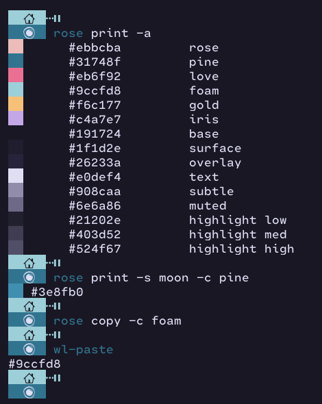

<h1 align="center">Welcome to rose 👋</h1>
<p>
  <a href="https://www.npmjs.com/package/rose" target="_blank">
    
  </a>
  <a href="https://twitter.com/amirography" target="_blank">
    
  </a>
</p>

> A little CLI application to help access Rose-Pine colorscheme easily.

## Install

```sh
go install github.com/amirography/rose@latest
```

## Usage



Print out the color 'pine', of the 'dawm' swatch:

```sh
rose print -s dawn -c pine
```

Print out every color of the default colorscheme:

```sh
rose print -a
```

Copy the color code of color `foam` from default swatch:

```sh
rose cp -c foam
```

## Author

👤 **Amir Alesheikh**

- Website: amirography.com
- Twitter: [@amirography](https://twitter.com/amirography)
- Github: [@amirography](https://github.com/amirography)
- LinkedIn: [@amirography](https://linkedin.com/in/amirography)

## Show your support

Give a ⭐️ if this project helped you!

---

## Thanks to

Wonderful (Rose-Pine)[https://github.com/rose-pine] creators.

_This README was generated with ❤️ by [readme-md-generator](https://github.com/kefranabg/readme-md-generator)_
